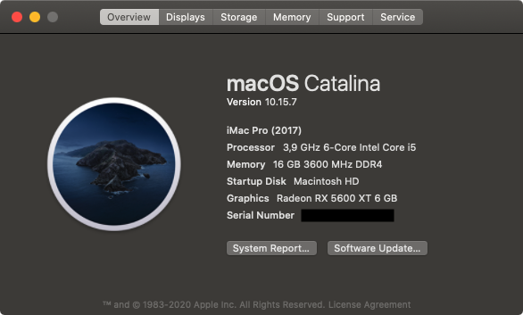
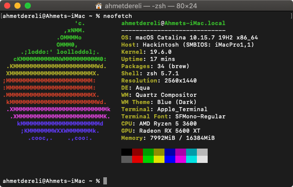
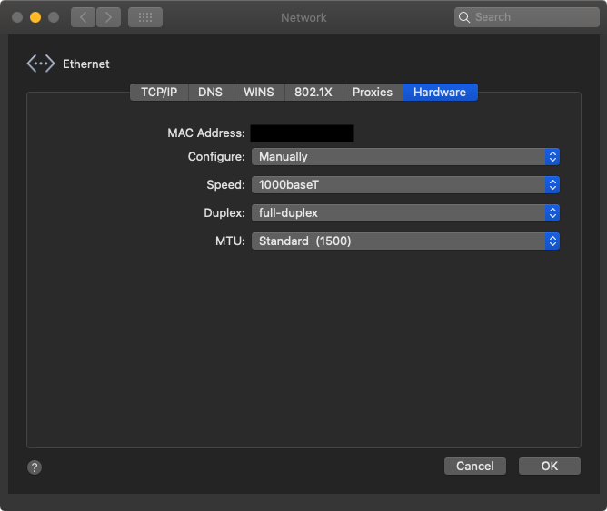

# AMD Ryzen Hackintosh - Opencore EFI for Asus TUF Gaming B550M-Plus (WI-FI)

 

## Specification
| **Component** | **Model** |
| ------------- | --------- |
| CPU | AMD Ryzen 5 3600 @ 3.6GHz |
| Motherboard | Asus TUF Gaming B550M-Plus (WI-FI) |
| RAM | 16GB (2 x 8GB) G.Skill RipjawsV @ 3600MHz |
| Audio Chipset | ALCS-1200A |
| GPU | Gigabyte RX 570 4GB |
| Ethernet | RTL8125 2.5GbE |
| WiFi & Bluetooth | Intel WiFi 6 AX200 |
| OS Disk (Sata3) | Toshiba TR200 240GB |

**macOS version**: 10.15.7 (19H2)  

**OpenCore version**: 0.6.1  

**SMBIOS**:  iMacPro1,1

## Drivers & Kexts
 - [[Bootloader] OpenCore](https://github.com/acidanthera/OpenCorePkg)
 - [[Patch] AMD_Vanilla](https://github.com/AMD-OSX/AMD_Vanilla)
 - [[Driver] FwRuntimeServices](https://github.com/acidanthera/OpenCorePkg)
 - [[Driver] HfsPlus](https://github.com/acidanthera/OcBinaryData/blob/master/Drivers/HfsPlus.efi)
 - [Driver] NTFS
 - [[Kext] Lilu](https://github.com/acidanthera/Lilu)
 - [[Kext] VirtualSMC](https://github.com/acidanthera/VirtualSMC)
 - [[Kext] WhateverGreen](https://github.com/acidanthera/WhateverGreen)
 - [[Kext] AppleALC](https://github.com/acidanthera/AppleALC)
 - [[Kext] AppleMCEReporterDisabler](https://github.com/AMD-OSX/AMD_Vanilla/blob/opencore/Extra/AppleMCEReporterDisabler.kext.zip)
 - [[Kext] LucyRTL8125Ethernet](https://github.com/Mieze/LucyRTL8125Ethernet)
 - [[Kext] AirportItlwm](https://github.com/OpenIntelWireless/itlwm)
 - [[Kext] IntelBluetoothFirmware](https://github.com/OpenIntelWireless/IntelBluetoothFirmware)
 - [[Kext] AMDRyzenCPUPowerManagement](https://github.com/trulyspinach/SMCAMDProcessor)
 - [[Kext] SMCAMDProcessor](https://github.com/trulyspinach/SMCAMDProcessor)
 - [Kext] USBPorts

## Working
- Ethernet - Settings -> Network -> Ethernet -> Advenced -> Hardware: Set Configure from Automatically->Manually Then set Speed to 1000baseT, click ok and apply.

	-- When firts install, you can set via terminal:

	`ifconfig en0 media 1000baseT`

	

- Wireless - [See details](https://openintelwireless.github.io/itlwm/)
- Bluetooth
- Audio
- DRM 
- USB
- Etc.

## Not working
 - **Sleep/Wake**
 - AirDrop (Not yet)
 - Hypervisor.framework (VirtualBox and XCode iOS emulator works)
 - Android Studio emulator (Can be replaced with Genymotion)

## How to use
  1. Create directory "EFI" in your EFI partition (e.g. pendrive or hard drive)
  2. Clone this repo and paste directiories "BOOT" and "OC" onto created directory
  3. Download [**GenSMBIOS**](https://github.com/corpnewt/GenSMBIOS) to generate unique SMBIOS information. Run it and select **Generate SMBIOS**, as model select **iMacPro1,1**.
  4. Open config.plist with [**ProperTree**](https://github.com/corpnewt/ProperTree) and go to PlatformInfo > Generic. Set MLB (Board Serial), SystemSerialNumber (Serial) and SystemUUID (SmUUID) to generated values.
  5. Boot it!  

## Disclaimer

This documentation is published for the sole purpose of learning and tech enthusiasm and with no guarantees of any kind, I’m not responsible of any harm of any kind or loss of data that may occur.
